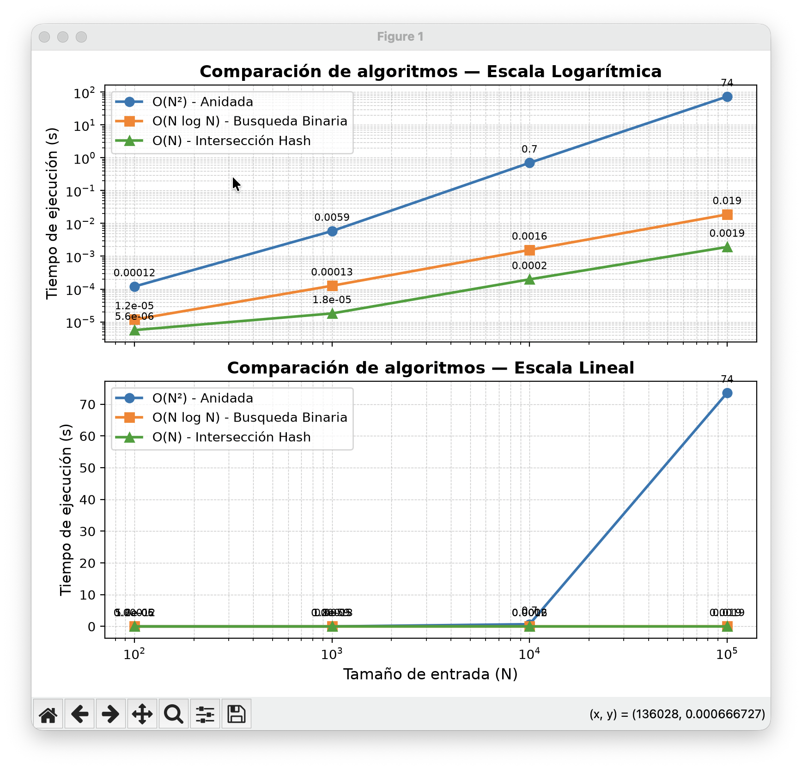

# Análisis complejo de filtrado de elementos comunes entre dos arreglos

Esta es la solución de la Evaluación 2 de Análisis de Algoritmos Avanzado. El proyecto compara tres formas de encontrar la intersección entre dos arreglos de enteros:

- **Variante A - Método anidado:** recorre cada elemento de `A` y lo compara con todos los elementos de `B`. Complejidad: `O(N²)`.
- **Variante B - Búsqueda binaria:** ordena `B` y busca cada elemento de `A` mediante búsqueda binaria. Complejidad: `O(N log N)`.
- **Variante C - Intersección hash:** convierte `B` en un conjunto y verifica la pertenencia de cada elemento de `A`. Complejidad esperada: `O(N)`.

## Ejecución del proyecto

Se requiere tener instalado Python y `uv`. Desde la carpeta raíz del proyecto se ejecutan los siguientes comandos:

```bash
uv sync
uv run main.py
```

`uv sync` instala las dependencias definidas en `pyproject.toml` y `uv.lock`. Luego, `uv run main.py` ejecuta las mediciones, muestra los resultados en la terminal y genera la gráfica comparativa.

El benchmark para `N = 10⁵` puede tardar más que los demás tamaños porque el método anidado realiza aproximadamente `N²` comparaciones.

## 1. Medición del peor caso

Para construir el peor caso se generan dos arreglos disjuntos:

```text
A = [0, 1, ..., N - 1]
B = [N, N + 1, ..., 2N - 1]
```

Después se mezclan los elementos de cada arreglo. Como no existe ningún elemento común, el método anidado debe completar todas sus comparaciones y las otras variantes deben revisar todos los elementos de `A`.

El tiempo se mide con `time.perf_counter()` mediante un decorador aplicado a cada algoritmo. En el caso de la búsqueda binaria, la medición incluye el ordenamiento de `B`; en el caso del método hash, incluye la conversión de `B` a `set`.

Los resultados obtenidos fueron:

| Tamaño `N` | Método anidado (s) | Búsqueda binaria (s) | Método hash (s) |
|---:|---:|---:|---:|
| 100 | 0.000119750 | 0.000011792 | 0.000005625 |
| 1 000 | 0.005856458 | 0.000126292 | 0.000018083 |
| 10 000 | 0.702677458 | 0.001557459 | 0.000197875 |
| 100 000 | 73.572275583 | 0.018792750 | 0.001917792 |

La tabla muestra que el método anidado aumenta mucho más rápido que los otros dos. Para `N = 100000`, tarda aproximadamente 73.57 segundos, mientras que la búsqueda binaria tarda 0.0188 segundos y el método hash 0.0019 segundos.

## 2. Gráfica de resultados

La gráfica utiliza el tamaño de entrada en escala logarítmica. El panel superior también utiliza escala logarítmica para el tiempo, lo que permite comparar las tres curvas aunque sus valores sean muy diferentes. El panel inferior conserva el eje vertical lineal para mostrar el crecimiento absoluto del método anidado.



En la gráfica se observa que:

- La curva del método anidado crece aproximadamente de forma cuadrática.
- La búsqueda binaria crece mucho más lentamente, aunque incluye el costo de ordenar `B`.
- El método hash presenta el menor tiempo en todos los tamaños medidos.
- La diferencia entre las variantes se vuelve especialmente evidente a partir de `N = 10000`.

## 3. Identificación de `N*`

Se construye una tabla adicional con tamaños pequeños y se repiten las mediciones varias veces. Para reducir el efecto de fluctuaciones del sistema se utiliza la mediana de las mediciones de cada tamaño.

El punto de cruce obtenido fue:

```text
N* aproximado: 5
 size  tiempo anidado  tiempo busqueda binaria
    5     0.000000500              0.000000458
```

Por tanto, en esta ejecución la búsqueda binaria comienza a superar al método anidado aproximadamente en `N = 5`. Este valor es experimental y puede variar ligeramente entre ejecuciones debido a que los tiempos para tamaños pequeños son muy reducidos y sensibles a la carga del sistema.

## Conclusiones

La solución confirma experimentalmente el comportamiento esperado de las complejidades:

- El método anidado es sencillo, pero deja de ser conveniente rápidamente por su crecimiento `O(N²)`.
- La búsqueda binaria mejora considerablemente el rendimiento y es adecuada cuando se acepta ordenar el segundo arreglo.
- La intersección hash obtiene el mejor rendimiento en este experimento porque las búsquedas de pertenencia en un conjunto tienen costo esperado constante.

Los resultados muestran que la elección del algoritmo tiene un efecto decisivo cuando aumenta el tamaño de los datos.
